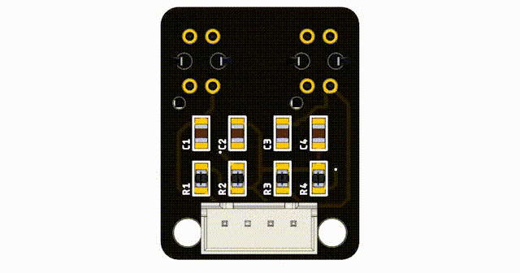

Line Follower Sensor
===========================
Line follower sensors detect the presence of a black line by emitting infrared (IR) light and detecting the light levels that return to the sensor. They do this using two components:

- An emitter
- A light sensor (receiver)

    
    
How to use a line sensor
------------------------------------------------------------------------------

You know a bit more how a line follower sensor works, now you should learn how to use it. The line follower sensor also has an array of pins, some of which you will have to connect to the Raspberry Pi you are using:

- VCC needs to be connected to a voltage in between 3.3 and 5V, to power the device
- GND is the ground pin that is required to complete the circuit
- AO is the analogue output (this pin will not work with the Raspberry Pi)
- DO is the digital output pin (this pin will work with the Raspberry Pi)
